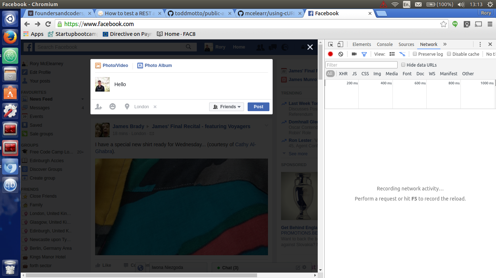
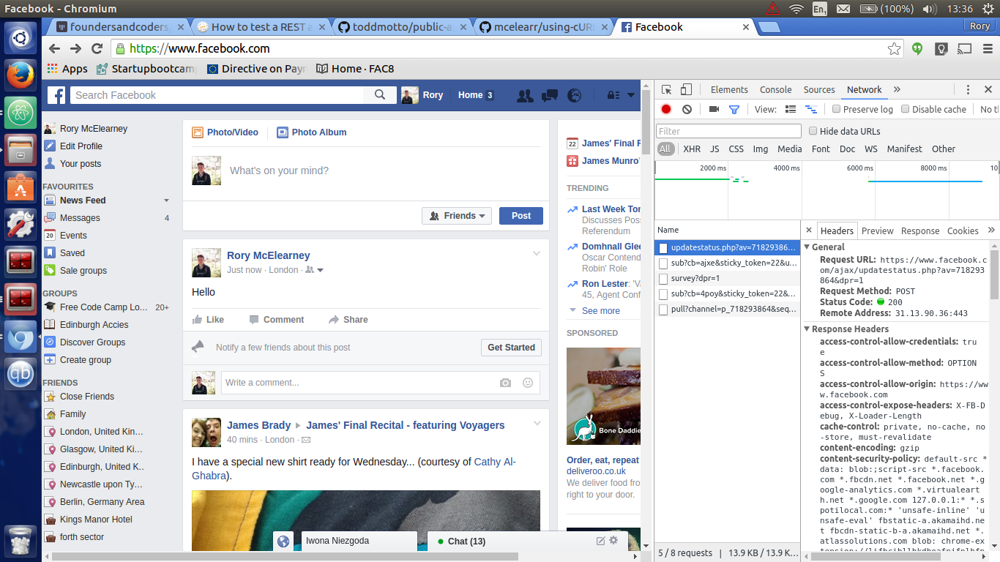
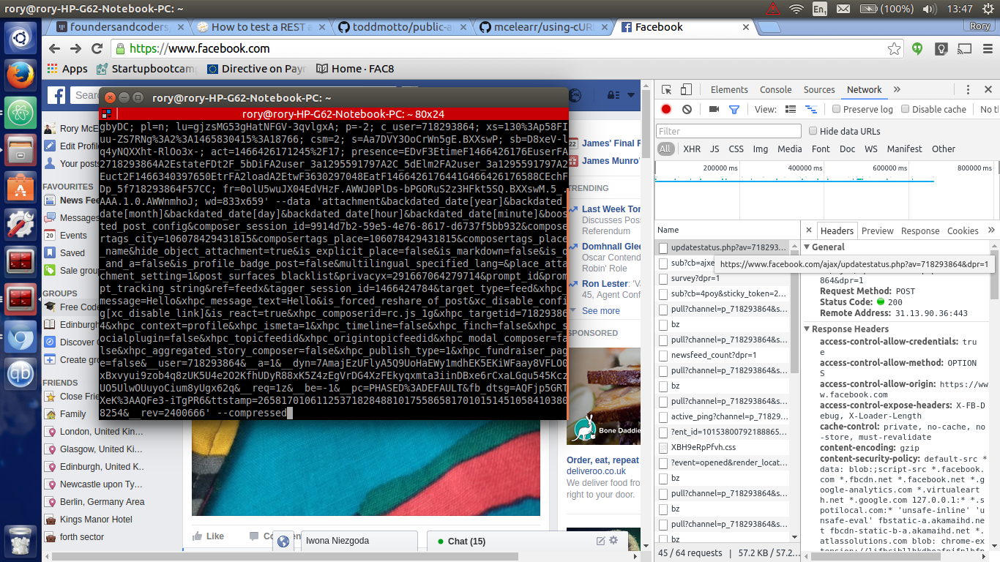

As well as simple requests, more complicated API requests can also be made using cURL. This is necessary to make API calls to many websites which require a private access and/or user cookie data. To show you an example of this from a website we are all familiar with, we're going to update our facebook status from the command line using cURL with help from the Chrome Inspector.

* Open up facebook and enter a new status but don't press 'post'. Open up the chrome inspector and got to the 'Network' tab. Network keeps a log of all the calls to other files; xhr (the one we're interested in) but also JS and CSS files.

* Press the clear button (the one next to the red circle) which will remove all of the calls which have happened up to that point. Now press 'post' to post your status to your facebook wall.

* On the righthand side, a new call should have appeared called updatestatus.php with the following details

URL: https://www.facebook.com/ajax/updatestatus.php?av=718293864&dpr=1

Request Method: POST

Status Code: 200

Remote Address: 31.13.90.36:443

* If you tried to POST directly, the request would fail because you do not have an access key. But we can use cURL to post this or another status by associating our cURL request with the access key and session details used in this in-browser example.

* Right-click on the XHR request in the Network tab in the Chrome Inspector and select 'Copy as cURL'. Delete your status update on facebook.

* Open your terminal and paste in the cURL request you have just copied to the clipboard. Hit enter in the terminal to send the API POST request and refresh your browser.

* If you're feeling bold, you can even change the message that you post by finding the part of the cURL request with the message tag and changing the message text.
